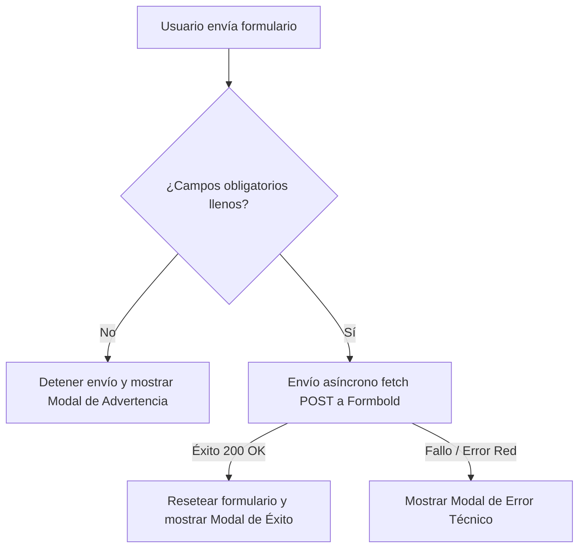

# Propuesta Técnica: Validaciones, Accesibilidad y Modal de Feedback en Contacto

## 1. Justificación de la Arquitectura
Esta propuesta define una actualización robusta y aislada para la página de contacto (`src/pages/contacto.astro`), enfocándose en mejorar la experiencia del usuario (UX) mediante validaciones rigurosas en el cliente, señales visuales claras de obligatoriedad, y un sistema integrado de retroalimentación (feedback) a través de un componente modal 100% nativo.

El enfoque arquitectónico se mantiene fiel a la naturaleza estática del proyecto (Astro SSG) y a las pautas de rendimiento extremo al **evitar por completo librerías externas de modales o validación** (como SweetAlert o Formik/Yup) y en su lugar emplear **Vanilla JS nativo** y clases utilitarias de **Tailwind CSS**.

---

## 2. Mapeo de Requisitos No Funcionales (RNF)

### RNF1: Rendimiento y Velocidad (Speed)
* **Carga de Scripts Ultra-Ligera**: Al utilizar Vanilla JS embebido en la isla estática nativa de Astro, el bundle de la página no incrementa su tamaño de manera perceptible. No se importan frameworks de JavaScript (React, Vue, Svelte) ni dependencias NPM adicionales.
* **Sin Peticiones HTTP Bloqueantes**: Los iconos vectoriales (SVG) para los estados del modal se incrustarán inline en el marcado HTML, eliminando peticiones externas de red para cargar imágenes o tipografías de iconos adicionales.

### RNF2: Adaptabilidad y Responsive (Mobile-First)
* **Diseño del Modal Mobile-First**: El modal de feedback utilizará una envoltura con posicionamiento fijo (`fixed inset-0`) estructurada usando `flex items-center justify-center p-4` para asegurar que en pantallas pequeñas de smartphones se adapte perfectamente al ancho de pantalla con márgenes seguros, mientras que en desktop mantendrá un ancho máximo controlado (`max-w-md w-full`).
* **Interactividad Táctil Amigable**: Los botones del modal ("Entendido" / "Cerrar") contarán con áreas táctiles generosas (`py-3 px-8`) y micro-interacciones al hacer tap/hover (`active:scale-95 hover:shadow-lg transition-all`).

### RNF3: Accesibilidad y Semantic SEO (SEO & Accessibility)
* **Accesibilidad del Modal**: Se implementarán los atributos HTML5 y ARIA correspondientes para modales nativos:
  * El modal principal usará `role="dialog"` y `aria-modal="true"`.
  * Se gestionará dinámicamente el atributo `aria-hidden="true|false"` y clases de visibilidad del lector de pantalla.
  * Foco y control de escape nativo.
* **Semántica de Formularios**: Las validaciones en cliente complementarán (y no sustituirán) los atributos semánticos como `required` en los campos obligatorios correspondientes. Las etiquetas `<label>` e inputs mantendrán una relación idéntica a través de los atributos `for` e `id` respectivos.

---

## 3. Justificación de los Cambios de Campos Opcionales vs. Obligatorios
* **Campos Obligatorios de Contacto**: Se determinan cuatro campos base obligatorios para la prospección de negocios B2B: *Nombres y Apellidos*, *Correo Electrónico*, *Teléfono / WhatsApp* y el área de texto *Mensaje*. Esto garantiza la obtención de los datos necesarios para entablar una comunicación calificada.
* **Simplificación y Reducción de Fricción**: Se eliminan las restricciones obligatorias de *Servicios de Interés*, *Tamaño de la Organización* y *Preferencia de Contacto*, eliminando los asteriscos correspondientes y removiendo el atributo `required` de los inputs de radio. Esto reduce considerablemente la tasa de abandono del formulario.
