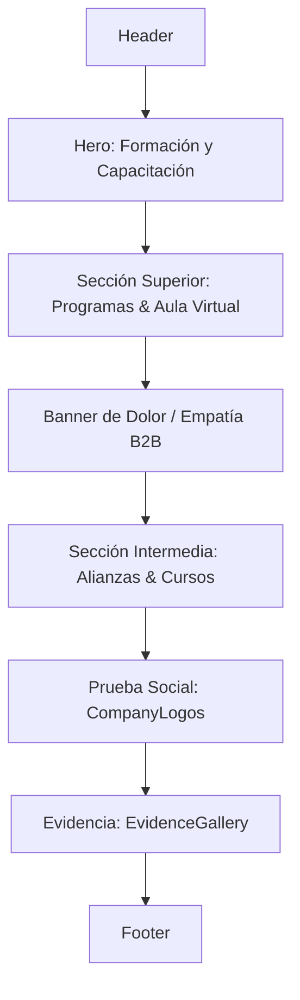

# Propuesta de Implementación: Sección de Contenido Central para Formación Continua

Esta propuesta detalla la estrategia y decisiones de diseño técnico para la implementación estructurada y fiel del contenido central de la página "Formación" en `src/pages/formacion.astro`.

## 1. Contexto y Objetivos

El objetivo principal es estructurar la página de Formación Continua de Matices B2B para reflejar con precisión su oferta formativa, integrando bloques secuenciales que guíen al usuario a través de un flujo de conversión lógico y persuasivo.

Se busca lograr:
1. **Flujo de Conversión Claro:** Desde la educación/información inicial (aula virtual y programas) hasta la toma de decisión (alianzas, personalización y propuestas).
2. **Reutilización de Componentes:** Consumir de manera eficiente los elementos globales y de UI existentes en el proyecto (`CompanyLogos` y `EvidenceGallery`).
3. **Consistencia Visual:** Adherirse al 100% al sistema de diseño "Natural Vitality" mediante Tailwind CSS v4.

---

## 2. Bloques de Contenido Secuenciales

El cuerpo principal de la página (`<main>`) se organizará en los siguientes bloques, situados secuencialmente entre `<Header />` y `<Footer />`:

1. **Hero de Formación:** Mantiene la sección introductoria con el botón secundario y la imagen representativa optimizada de talleres.
2. **Sección Superior de Formación:**
   - **Cabecera informativa:** "Programas de Formación Continua" que resalta el fortalecimiento de competencias junto a docentes con una trayectoria sobresaliente.
   - **Subbloque Aula Virtual:** "Conoce nuestro calendario y aula virtual", detallando que es un servicio exclusivo para Chile y Latinoamérica. Cuenta con el botón de acción directa "INGRESAR A AULA VIRTUAL" que redirige al LMS externo.
3. **Banner de Dolor / Empatía (Fondo Oscuro):**
   - Bloque de fondo texturizado y oscuro para incentivar la consultoría organizacional en formación. Cuenta con el CTA comercial destacado "HABLEMOS AHORA".
4. **Sección Intermedia de Alianzas y Cursos:**
   - Estructura complementaria dividida en dos subbloques limpios:
     - **Alianzas y Representación Internacional:** Detalla la red de soporte exclusivo.
     - **Cursos y Programas Personalizados:** Explica el diseño a medida de entrenamiento para corporaciones.
   - Finaliza con el botón destacado "SOLICITAR PROPUESTA".
5. **Prueba Social (Clientes):** Integración directa del componente `<CompanyLogos />`.
6. **Galería de Evidencia:** Integración del componente `<EvidenceGallery />` envuelto en un contenedor semántico y estético.

---

## 3. Mapeo a Requisitos No Funcionales (RNF)

### RNF1: Rendimiento Extremo (Speed)
* **Astro SSG:** La página se compila como HTML/CSS 100% estático, garantizando un tiempo de carga inmediato y eliminando la sobrecarga de JS en el lado del cliente.
* **Procesamiento de Imágenes con `<Image />`:** Toda nueva imagen se procesará obligatoriamente con el componente de Astro, convirtiéndose automáticamente a formato `.webp` / `.avif` y optimizando dimensiones.
* **Estrategia de Carga:** Se configurará `loading="eager"` solo para las imágenes del primer pliegue (Hero), y `loading="lazy"` para secciones inferiores.

### RNF2: Responsividad Móvil (Mobile-First)
* **Diseño Baseline Celular:** Todas las estructuras se diseñarán usando layouts verticales de una sola columna como base predeterminada (`w-full flex flex-col p-4`).
* **Escalado Desktop:** Las rejillas y disposiciones en columnas se activarán progresivamente utilizando los prefijos `md:` y `lg:` para pantallas medianas y grandes.
* **Jerarquía Superior:** Los textos de valor y los botones CTA principales ocuparán la posición superior y centralizada en las vistas móviles para maximizar la conversión en dispositivos de mano.

### RNF3: SEO Técnico y Accesibilidad
* **HTML5 Semántico Estricto:** Organización lógica usando las etiquetas `<main>`, `<section>` y `<article>` para la estructuración de cursos e hitos informativos.
* **Estructura de Encabezados:** Mapeo jerárquico impecable: un único `<h1>` (en Hero), seguido de etiquetas `<h2>` para los bloques principales, y `<h3>` para subbloques de tarjetas.
* **Atributos Alt Descriptivos:** Cada elemento de imagen integrará un atributo `alt` enriquecido que describa semánticamente su función, asegurando la legibilidad para lectores de pantalla.
