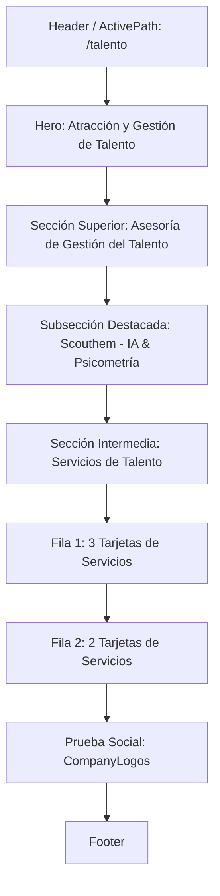

# Propuesta de Implementación: Sección de Contenido Central para Gestión del Talento

Esta propuesta detalla la estrategia y decisiones de diseño técnico para la implementación estructurada y fiel del contenido central de la página "Talento" en `src/pages/talento.astro`.

## 1. Contexto y Objetivos

El objetivo principal es implementar la sección central de la página de Gestión del Talento de Matices B2B para reflejar con precisión su propuesta de valor, integrando bloques secuenciales que guíen al usuario a través de un flujo de conversión lógico, elegante y con base científica.

Se busca lograr:
1. **Flujo de Conversión Claro:** Desde la asesoría en talento y la solución especializada "Scouthem – IA y Psicometría Avanzada", pasando por la visualización estructurada de los servicios, hasta la conversión directa de prospectos B2B en `/contacto`.
2. **Reutilización Eficiente de Componentes:** Consumir de manera inteligente el componente global preexistente `<CompanyLogos />` para potenciar la prueba social del sitio.
3. **Consistencia Visual Absoluta:** Adherirse al 100% al sistema de diseño "Natural Vitality" mediante Tailwind CSS v4, consumiendo las variables semánticas del proyecto (`--color-matices-*` / `verde-bosque`, `verde-lima`, `crema-calido`, `azul-celeste`) sin añadir CSS personalizado.

---

## 2. Bloques de Contenido Secuenciales

El cuerpo principal de la página (`<main>`) se organizará en los siguientes bloques, situados secuencialmente después del Hero Section actual y antes del componente `<Footer />`:

1. **Sección Superior de Gestión del Talento:**
   - **Cabecera de Entrada:** Título "Te Asesoramos en Gestión del Talento" (`h2` en tipografía de cabecera Playfair Display) con texto de soporte enfocado en estándares de calidad metodológica y base científica robusta.
   - **Solución Exclusiva:** Bloque de destaque para la tecnología "Scouthem – IA y Psicometría Avanzada", detallando formalmente la acreditación como representantes exclusivos regionales.
   - **CTA de Herramienta:** Botón destacado "CONOCER SCOUTHEM" diseñado como enlace ancla directo a `/testing#scouthem` o la sección de tecnología de testing del sitio.
2. **Sección de Servicios de Talento:**
   - **Encabezado del Módulo:** Título destacado "SERVICIOS DE TALENTO".
   - **Distribución de Rejilla (Grid):**
     - **Grupo 1 (3 tarjetas):** *Reclutamiento y Selección*, *Evaluación de Competencias*, *Assessment y Psicometría*. Se estructuran en una cuadrícula responsiva que escala de 1 a 3 columnas.
     - **Grupo 2 (2 tarjetas):** *Gestión del Desempeño*, *Planes de Desarrollo*. Se estructuran en una cuadrícula responsiva que escala de 1 a 2 columnas en pantallas de escritorio.
   - **Contenido de Tarjetas:** Cada una de las 5 tarjetas contará de forma obligatoria con:
     - Su respectiva fotografía temática (optimizada mediante Astro `<Image />` desde `src/assets/gallery/` de manera estratégica).
     - Título explicativo semántico (`h3` o `h4`).
     - Enlace interactivo "Contactar Aquí" que apunta directamente a `/contacto` (formulario B2B).
3. **Prueba Social / Clientes:**
   - Integración directa y obligatoria del componente preexistente `<CompanyLogos />` para renderizar el carrusel dinámico de marcas asociadas.

---

## 3. Mapeo a Requisitos No Funcionales (RNF)

### RNF1: Rendimiento Extremo (Speed)
- **Astro SSG:** Compilación de la página como HTML/CSS 100% estático, garantizando tiempos de carga de primer pliegue ultra rápidos y eliminando JavaScript superfluo en el cliente.
- **Optimización de Imágenes con `<Image />`:** Procesamiento automático de todas las fotos de las tarjetas mediante el componente nativo de Astro. Esto garantiza la conversión a formatos web modernos (`.webp` o `.avif`) con compresión óptima de bytes.
- **Carga Diferida (Lazy Loading):** Las imágenes de las tarjetas de servicios (situadas debajo del pliegue inicial) se cargarán con el atributo `loading="lazy"` para no retrasar el renderizado inicial de la página.

### RNF2: Responsividad Móvil (Mobile-First)
- **Baseline Móvil:** El diseño y disposición de los bloques y columnas partirán de configuraciones de columna única (`grid-cols-1` o `flex-col`) con márgenes móviles (`p-4` o `px-6`).
- **Escalado Desktop:** Las rejillas de tarjetas se expandirán progresivamente utilizando modificadores responsivos (`md:grid-cols-2 lg:grid-cols-3` y `lg:grid-cols-2` respectively).
- **Prioridad Superior:** Se asegura que los títulos explicativos y los botones CTA principales tomen la posición superior y centralizada en móvil para optimizar la retención y conversión táctil.

### RNF3: SEO Técnico y Accesibilidad
- **HTML5 Semántico Estricto:** Estructuración mediante etiquetas nativas limpias, tales como `<main>`, `<section>` y `<article>` para delimitar las tarjetas de servicio.
- **Jerarquía de Encabezados Excepcional:** Un único `<h1>` en el Hero Section, seguido por etiquetas `<h2>` para los encabezados de sección principales ("Te Asesoramos...", "Servicios de Talento"), y `<h3>`/`<h4>` para los subbloques y títulos de las tarjetas.
- **Atributos Alt Descriptivos:** Inyección obligatoria y descriptiva en la etiqueta `alt` de todas las imágenes integradas para garantizar accesibilidad completa en lectores de pantalla.
