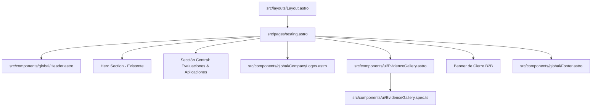

# Propuesta de Cambio: Implementación del Contenido Central de Testing

Este documento define la justificación arquitectónica, decisiones técnicas y el cumplimiento de los Requerimientos No Funcionales (RNF) para la implementación de la sección central de la página "Testing y Diagnóstico" (`src/pages/testing.astro`) y su componente asociado `src/components/ui/EvidenceGallery.astro`.

## 1. Objetivos del Cambio
* **Completar la experiencia de Testing:** Proveer a los usuarios B2B una estructura detallada e informativa sobre las metodologías científicas de testing, los 4 tipos de evaluaciones y sus aplicaciones prácticas de negocio.
* **Fidelización y Confianza:** Integrar prueba social de primer nivel mediante logotipos de aliados comerciales y evidenciar la actividad real a través de un mosaico de imágenes enriquecido.
* **Conversión B2B Optimizada:** Facilitar la captura de leads B2B mediante una sección de empatía con llamados a la acción claros hacia la agenda de consultoría y descarga de dossier.
* **Componentización y Reutilización:** Aislar el mosaico denso en un componente de galería reutilizable (`EvidenceGallery.astro`) con su correspondiente suite de testing unitario.

## 2. Justificación Técnica y Arquitectura de Datos

### Estructura de Componentes y Modularización

* **`src/pages/testing.astro`**: Página principal estática que orquesta las secciones de contenido en orden secuencial. Al compilarse 100% como HTML estático (SSG), eliminamos la carga de JavaScript en el cliente, optimizando el tiempo de interacción inicial (TTI).
* **`src/components/ui/EvidenceGallery.astro`**: Componente modular que encapsula el comportamiento del mosaico denso. Lee dinámicamente las imágenes de talleres, conferencias y actividades ubicadas en `src/assets/gallery/` usando la función integrada de importación de assets de Astro, lo que garantiza que cualquier nueva imagen añadida en el futuro se integre automáticamente.
* **`src/components/ui/EvidenceGallery.spec.ts`**: Test unitario escrito en Vitest para validar la renderización semántica del componente y el comportamiento correcto frente a la ausencia de recursos.

---

## 3. Mapeo y Cumplimiento de Requerimientos No Funcionales (RNFs)

### RNF1: Rendimiento Extremo de Carga (Performance & Core Web Vitals)
* **Procesamiento Nativo de Imágenes:** Queda estrictamente prohibido el uso de la etiqueta estándar ``. Se implementará el componente `<Image />` de `astro:assets` para procesar, redimensionar y comprimir todas las imágenes de la galería y secciones de soporte a formatos de última generación (`.webp` o `.avif`).
* **Estrategia de Carga Inmediata y Diferida (Lazy/Eager):**
  * La imagen del Hero (superior) mantiene su atributo `loading="eager"` para optimizar el **Largest Contentful Paint (LCP)**.
  * Todas las imágenes secundarias del contenido central y el mosaico de la galería de evidencia se configurarán con `loading="lazy"` y decodificación asíncrona (`decoding="async"`) para no bloquear el renderizado del hilo principal del navegador.

### RNF2: Adaptabilidad y Presentación Mobile-First
* **Diseño Responsivo Fluido:** Todas las nuevas secciones se diseñarán con un enfoque móvil nativo. Por defecto, las cajas y los contenedores flexibles se organizarán en una sola columna (`flex flex-col` o `grid grid-cols-1`) con espaciado móvil (`px-4 py-12`).
* **Escalado Desktop Controlado:** Utilizaremos exclusivamente los modificadores responsivos de Tailwind CSS (`md:`, `lg:`) para expandir las estructuras a columnas múltiples en tablets y pantallas de escritorio.
* **Colapso Limpio de la Galería Masonry:** El mosaico de evidencia utilizará la propiedad nativa de CSS `columns-1 sm:columns-2 lg:columns-3` combinada con `break-inside-avoid`, asegurando un flujo de cascada denso y continuo que se ajusta automáticamente al ancho de la pantalla sin necesidad de dependencias pesadas de JS (como Masonry.js).

### RNF3: Semántica HTML5 y SEO Técnico
* **Esquema Semántico del DOM:**
  * Uso de `<main>` como contenedor principal de la página.
  * Organización de cada bloque de contenido independiente utilizando la etiqueta `<section>`.
  * Representación de cada tipo de evaluación psicométrica mediante `<article>`.
* **Jerarquía Estricta de Encabezados:** Mantendremos un único `<h1>` en la sección Hero. Los títulos de las secciones de contenido central utilizarán etiquetas `<h2>` semánticas, y las subcategorías o títulos de tarjetas utilizarán `<h3>`.
* **Accesibilidad (a11y):**
  * Se configurará de manera obligatoria un atributo `alt` descriptivo y único en cada imagen del mosaico y secciones de soporte, explicando claramente el contexto de la actividad representada.
  * Los botones y enlaces comerciales contendrán textos legibles y descriptivos para lectores de pantalla.
