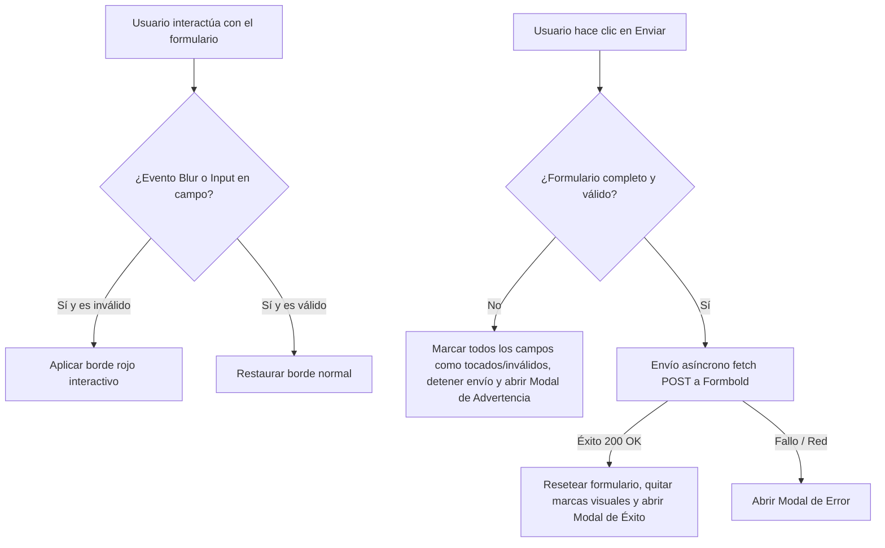

# Propuesta Técnica: Corrección de Expresión Regular de Teléfono y Validación Visual Reactiva

## 1. Justificación de la Arquitectura
Esta propuesta define los cambios técnicos necesarios para resolver el error de compilación y ejecución de la expresión regular del campo de teléfono en la página de contacto (`src/pages/contacto.astro`), actualizar su marcador de posición (*placeholder*) y habilitar validaciones visuales reactivas utilizando el API nativo de validación de HTML5 y Tailwind CSS.

El enfoque adoptado mantiene la filosofía del proyecto: cero dependencias externas y ejecución 100% en el cliente mediante Vanilla JS y clases utilitarias de Tailwind v4. Se reutilizará el componente modal de feedback existente en el archivo, invocando el estado de advertencia ante cualquier error o campo incompleto.

---

## 2. Mapeo de Requisitos No Funcionales (RNF)

### RNF1: Rendimiento y Velocidad (Speed)
* **Validación en Cliente Ligera**: El uso de la API de validación nativa de HTML5 (`checkValidity()`) y Vanilla JS no agrega peso significativo al bundle, evitando el uso de librerías pesadas de validación de formularios (como Formik, Yup o JustValidate).
* **Regex Eficiente**: La expresión regular recomendada se evalúa instantáneamente en el navegador mediante el atributo `pattern` y la validación nativa.

### RNF2: Adaptabilidad y Responsive (Mobile-First)
* **Feedback en Dispositivos Móviles**: Los bordes rojos y anillos de enfoque de error se adaptan a cualquier resolución sin cambiar las dimensiones del input, evitando saltos de diseño (*Layout Shift*) en pantallas móviles de 320px en adelante.
* **Placeholder Adaptado**: El placeholder actualizado `Ej. +56 9 1234 5678` proporciona un ejemplo claro del formato internacional requerido sin salirse del límite del contenedor en pantallas pequeñas.

### RNF3: Accesibilidad y Semantic SEO (SEO & Accessibility)
* **Atributos de Accesibilidad (ARIA)**: Se mantendrán y mejorarán las relaciones semánticas entre etiquetas `<label>` e inputs.
* **Manejo del Estado del Modal**: Al abrir el modal de advertencia, el script mantendrá los estándares del lector de pantalla (`aria-hidden="false"`) y enfocará el botón de cierre común para una navegación por teclado accesible.
